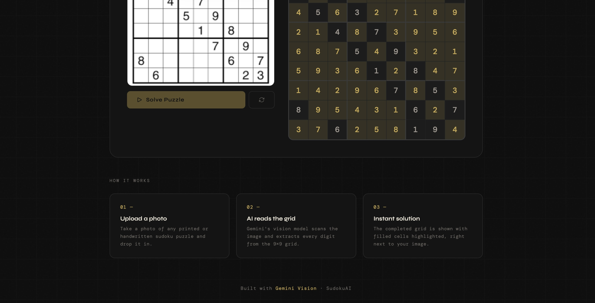

# SudokuAI

A web application that solves sudoku puzzles from photographs using Google Gemini Vision API.


## Overview

SudokuAI provides an efficient solution for automated sudoku recognition and solving. The application accepts image uploads of sudoku puzzles, extracts the grid using Google Gemini's vision capabilities, solves the puzzle, and displays the solution with visual distinction between given and computed cells.

## Features

- Image-based puzzle input supporting PNG, JPG, and WebP formats
- Automatic grid extraction using Gemini Vision API
- Complete puzzle solving with visual highlighting
- Responsive design for desktop and mobile devices
- Client-side processing with no backend requirements
- Optimized API calls with configurable timeouts


## Screenshots




## Technology Stack

- Frontend: HTML5, CSS3, Vanilla JavaScript
- Vision API: Google Gemini 1.5 Flash / 2.0 Flash
- Architecture: Single-page application with client-side rendering
- No external dependencies or build tools required

## Quick Start

### Prerequisites

- Google API key from [Google AI Studio](https://makersuite.google.com/app/apikey)
- Modern web browser (Chrome, Safari, Firefox, or Edge)
- Python 3 or Node.js for local server

### Installation

```bash
git clone https://github.com/yourusername/sudokuai.git
cd sudokuai
```

### Running Locally

Using Python:

```bash
python -m http.server 8000
```

Using Node.js:

```bash
npx http-server
```

Using Python 2:

```bash
python -m SimpleHTTPServer 8000
```

Then open browser to `http://localhost:8000`

### Configuration

1. Generate API key at [Google AI Studio](https://makersuite.google.com/app/apikey)
2. Open `index.html` in text editor
3. Locate line 772: `const GEMINI_API_KEY = 'PASTE_YOUR_API_KEY_HERE';`
4. Replace placeholder with your API key
5. Save and reload page

## API Configuration

Endpoint: `https://generativelanguage.googleapis.com/v1beta/models/gemini-1.5-flash:generateContent`

Available models:

- `gemini-1.5-flash`: Optimized for speed, recommended for most use cases
- `gemini-2.0-flash`: Increased accuracy with slightly higher latency

To change model, edit line 773 in index.html:

```javascript
const GEMINI_API_URL = 'https://generativelanguage.googleapis.com/v1beta/models/gemini-2.0-flash:generateContent';
```

## Project Structure

```
sudokuai/
├── index.html
├── README.md
├── LICENSE
├── .gitignore
├── .env.example
└── docs/
    ├── SETUP.md
    ├── DEPLOYMENT.md
    └── TROUBLESHOOTING.md
```

## Development

### Git Workflow

```bash
# Initialize repository
git init
git config user.name "Your Name"
git config user.email "your.email@gmail.com"

# Stage changes
git add .

# Create commit
git commit -m "Initial commit: SudokuAI with Gemini API integration"

# Connect to GitHub
git remote add origin https://github.com/yourusername/sudokuai.git
git branch -M main
git push -u origin main
```

### Future Updates

```bash
# After making code changes
git add .
git commit -m "Fix: optimize API response parsing"
git push
```

## API Response Handling

The application expects responses in the following JSON format:

```json
{
  "given": [5,3,0,0,7,...],
  "solution": [5,3,4,6,7,...]
}
```

Each array contains 81 elements representing the 9x9 grid. Zero values indicate empty cells.

## Error Handling

HTTP Status Codes:

- 404: Invalid model endpoint
- 401: Invalid or missing API key
- 403: API key lacks required permissions
- 500: Server error on Google's infrastructure
- 503: Service temporarily unavailable

The application includes automatic retry logic with exponential backoff for 503 responses.

## Image Quality Requirements

For optimal performance:

- Printed sudoku grids (higher accuracy than handwritten)
- Clear, well-lit photography
- Straight-on angle without rotation
- High contrast between grid and background
- Close-up framing showing entire puzzle

## Security Considerations

The current implementation stores the API key in client-side code. This approach is suitable for development and portfolio projects but should not be used in production environments. For production deployment:

1. Create a backend service to handle API calls
2. Store credentials in environment variables
3. Use server-side authentication and authorization

## License

MIT License. See LICENSE file for details.

## Contributing

1. Fork the repository
2. Create a feature branch: `git checkout -b feature/improvement`
3. Make changes and test thoroughly
4. Commit with descriptive messages: `git commit -m "Implement feature description"`
5. Push to branch: `git push origin feature/improvement`
6. Open a pull request

## Support

For issues, refer to TROUBLESHOOTING.md or open an issue on GitHub with:

- Error message and console output
- Steps to reproduce
- System information (OS, browser, version)
